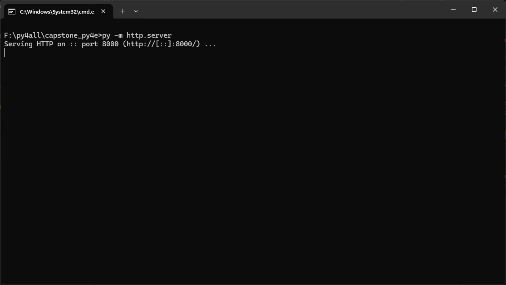
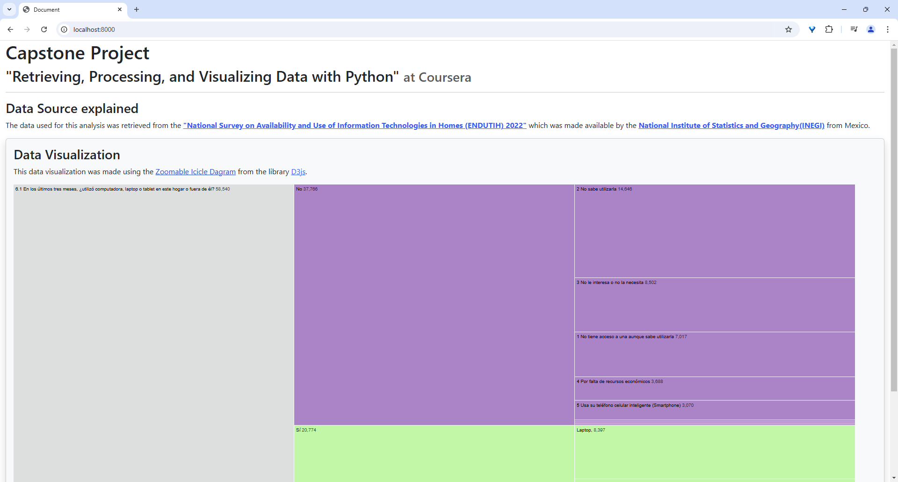

# Capstone Project
My capstone project for Dr. Chuck's course:

**"Retrieving, Processing, and Visualizing Data with Python"** at [Coursera](https://www.coursera.org/learn/python-data-visualization/home/info)

## Data Source explained
The data used for this analysis was retrieved from the "National Survey on Availability and Use of Information Technologies in Homes (ENDUTIH) 2022"[^1] which was made available by the **National Institute of Statistics and Geography(INEGI)**[^2] from Mexico. 

## Why did I choose this data?
INEGI publishes its data in a clean and organized manner where its posible to find the raw data, metadata, data dictionaries and even an E-R model of the data. 

## About the project
For this project I also tried to practice using OOP programming, the use of docstrings, and type hints in Python. Why type hinting? Since I come from languages like java and C#, I´ve become accustomed to "wanting to know" what data types to expect, and it makes it easier for me to read the code. 

Most of the functioning of the app revolves around the class **Usuario** and class **DataDictUsuario**. Both of these classes offer functions that are used in the [importing](#importing-data-to-the-content-database) phase and [chart data building](#building-the-chart-data) phase.


## Importing data to the content database
In the datasorces folder inside this project there are several subfolders. The ones we will be using are 2:
- conjunto_de_datos (DataSets)
- diccionario_de_datos (Data Dictionaries)

We can find the paths of the source files in the settings.py file. This file contains dictionaries that hold the routes for the files and databases.

To import the data we need to navigate to the project folder (capstone_py4e) and execute the following command:

```py .\import_data.py```

## Building the Chart Data
By building the chart data we will generate a JSON file that will feed the [D3js](https://d3js.org/) Chart used in this project. To start this process it´s necessary to first [import the data](#importing-data-to-the-content-database).

To build the chart data we need to navigate to the project folder (capstone_py4e) and execute the following command:

```py .\build_chart_data.py```


## Opening the Chart 


The data visualization (Chart) was made using the [Zoomable Icicle Dagram](https://observablehq.com/@d3/zoomable-icicle) from the library [D3js](https://d3js.org/).

To view the chart we need to navigate to the project folder (capstone_py4e) and execute the following command:

```py -m http.server```

that will start an HTTP server that will host the static file index.html. This is necessary because I was not able to load the JSON file without a server. 



Then we open the browser and navigate to localhost and the port given by the previous command. For example:

```http://localhost:8000/```



## Docs and articles used for this project
These are additional resources I read while researching for this project: 
- OOP in python
    - https://realpython.com/python3-object-oriented-programming/
    - https://grzegorz-makowski.medium.com/understanding-self-and-cls-in-python-b674f5e5951d
- Getting or Setting python class attributes by name
    - https://stackoverflow.com/questions/2612610/how-to-access-get-or-set-object-attribute-given-string-corresponding-to-name-o
- os.path join()
    - https://www.geeksforgeeks.org/python-os-path-join-method/
- enumerate
    - https://www.geeksforgeeks.org/how-to-access-index-in-for-loop-python/
- CSV
    - https://docs.python.org/3/library/csv.html
    - https://stackoverflow.com/questions/17912307/u-ufeff-in-python-string
- Docstring 
    - https://peps.python.org/pep-0257/
    - https://www.geeksforgeeks.org/python-docstrings/
    - https://realpython.com/documenting-python-code/
- Sqlite3 insert
    - https://stackoverflow.com/questions/6242756/how-to-retrieve-inserted-id-after-inserting-row-in-sqlite-using-python
- Sqlite3 rows by name
    - https://docs.python.org/3/library/sqlite3.html#sqlite3-howto-row-factory
- Type hints:
    - https://mypy.readthedocs.io/en/stable/cheat_sheet_py3.html
    - https://stackoverflow.com/questions/63503512/python-type-hinting-own-class-in-method
- Python HTTP server
    - https://medium.com/@solomon.chidera/pythons-http-server-module-453fa31420fb
- D3js 
    - https://d3js.org/getting-started
    - https://observablehq.com/@d3/zoomable-sunburst
    - https://www.freecodecamp.org/news/how-to-read-json-file-in-javascript/
    - https://youtu.be/C4t6qfHZ6Tw?si=Q970CorMQ4bBeM_z&t=449
    - https://observablehq.com/@d3/zoomable-icicle
- Python List comprehension
    - https://www.w3schools.com/python/python_lists_comprehension.asp
- Twitter bootstrap
    - https://getbootstrap.com/docs/5.3/layout/containers/
- Sqlite Group By
    - https://www.sqlitetutorial.net/sqlite-group-by/
- JSON in JS
    - https://www.freecodecamp.org/news/how-to-read-json-file-in-javascript/
- Python Json Serialization
    - https://medium.com/@techclaw/python-dict-to-json-simplifying-data-serialization-81a8d4eeb512

[^1]: [Encuesta Nacional sobre Disponibilidad y Uso de Tecnologías de la Información en los Hogares (ENDUTIH) 2022](https://www.inegi.org.mx/programas/dutih/2022/)

[^2]: [Instituto Nacional de Estadística y Geografía (INEGI)](https://www.inegi.org.mx/default.html) 


